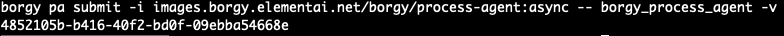
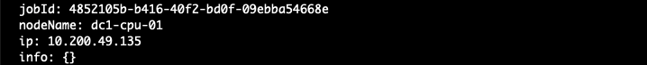
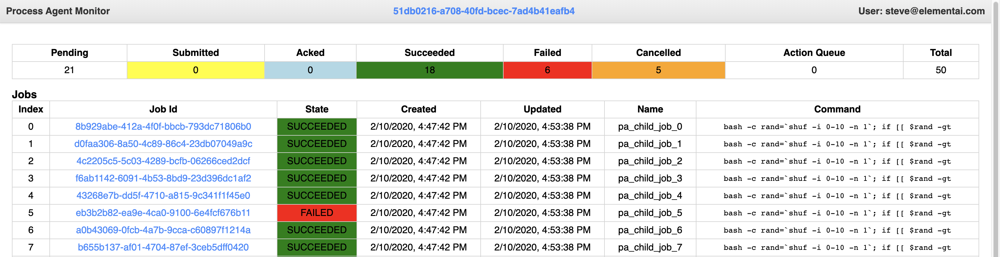

## Overview
The agent can be used in 2 main ways, by invoking the official docker image with a path to your
user code (**recommended**), or by installing the agent framework locally as a package and calling
it from your own code.

Before we write any user code, it's useful to understand the agent protocol at a high level.
The agent can be thought of as a kind of process manager, starting, observing and stopping jobs while providing
updates to the user about the status of each job. At the same time it also acts like a mini-dashboard,
used see the current state of your jobs, like the Task Manager in Windows or the Activity Monitor in OSX.


## Basic usage
Let's walk through a simple usecase to get a sense of how the agent works.

Say that as a researcher you'd like to ensure a given model produces the same results
(within a reasonable statistical margin) on every run. All we need to do is get the agent to
submit the same job multiple times and let us know when things are done so we can analyze the
output.

At the very least, we'll need to implement the `user_create` function and if we don't care about
updates we'll stub out the update function.

```python
jobs_to_submit = [
    {'command': ['/code/mymodel.py'], 'image': 'images.borgy.elementai.net/myproject/myimage:latest'},
    {'command': ['/code/mymodel.py'], 'image': 'images.borgy.elementai.net/myproject/myimage:latest'},
    {'command': ['/code/mymodel.py'], 'image': 'images.borgy.elementai.net/myproject/myimage:latest'},
    {'command': ['/code/mymodel.py'], 'image': 'images.borgy.elementai.net/myproject/myimage:latest'}
]

def user_create(agent):
    global jobs_idx, jobs_to_submit
    if jobs_to_submit:
        return [jobs_to_submit.pop()]
    return None

def user_update(agent, jobs):
    pass
```

The `jobs_to_submit` array declares all jobs in advance in JobSpec format. It's simply a dict that
describes the job to run and if you've run jobs on Ork before you'll already be familiar with it.
If not, you can find a detailed breakdown of the job spec object here: [Job specs](https://docs.borgy.elementai.net/pages/jobs.html#the-job-specification)
Another neat way to get a working template of this object (in YAML) is to run `borgy submit -n`.

```python
{'command': ['bash', '-c', 'sleep 30'], 'image': 'ubuntu:18.04'}
```
**Note:** Since we're using an official image from DockerHub in this example, we don't need to do anything special
to use it, but if you built an image locally (which is likely the case) you'll need to first push it to our internal
registry before it's usable in the cluster. (ex: images.borgy.elementai.net/myproject/myimage)

Next, we define the `user_create` function. This function will be called by the agent to submit new jobs to
the cluster on your behalf. In the case above we only submit a single job at a time but we put it in an array
because that's what the agent expects as the return value from `user_create`. We'll visit the `agent` argument
passed into this function in a later section to see how it's used but for now it's not needed except that it has
to be declared.

```python
def user_create(agent):
    global jobs_idx, jobs_to_submit
    if jobs_to_submit:
        return [jobs_to_submit.pop()]
    return None
```

You can see the `user_create` function returns None once it emptied out the `jobs_to_submit` array. This is necessary
to let the agent know we're completely done and there won't be anymore jobs coming at all. The value has to be `None` and not an
empty array (`[]`), for example, because an array will be interpreted as `we don't have jobs right now, but please try again later`.
This is very important because if you forget to return None when you're done the agent will never shutdown automatically
and you'll need to kill it manually using `borgy kill id_of_my_pa` or by CURL'ing `http://agent_ip:8666/kill`.

Lastly, we insert an empty stub for the `user_update` because at the moment we don't care about job updates.
The only thing to remember here is that it must be named `user_update` and should accept the `agent` and `jobs`
arguments.
```python
def user_update(agent, jobs):
    pass
```

Once all this is done, we need to make our user code available in a location where the agent running
in the cluster will be able to find it when running. The easiest option is to upload it to
someplace on /mnt/ like your home directory. For example:
```sh
scp ./myusercode.py wks03:~/code/
```
You should now have a myusercode.py file under `~/code`.

We're now ready to start a process agent and let it execute our jobs!

To submit the job, you need to use the `pa` subset of command in the borgy CLI.
```sh
borgy pa submit -H -i images.borgy.elementai.net/borgy/process-agent:2.0.0 -- borgy_process_agent -c /mnt/home/myusername/code/myusercode.py
```

Here's a breakdown of the command:

1. `borgy pa submit` -- The `pa` bit is required to let the cluster know we're trying to run a special process agent job and not a regular one.
1. `-i images.borgy.elementai.net/borgy/process-agent:2.0.0` - Specifies the image to use for the current job. Since we're running an agent job we have to use
the premade agent image already present in the cluster. Note also we specify the tag to use the most recent agent, but you could also specify older versions
like 1.18.1.
1. `-H` -- Recall that we put the user code in our home directory and now we need a way for this to be accessible
to the agent. This cli option automatically make the agent job mount this path `/mnt/home/myusername/` into the
job's docker container, saving us having to specify this by hand `-v /mnt/home/myusername:/mnt/home/myusername`.
1. `borgy_process_agent -c /mnt/home/myusername/code/myusercode.py` -- This portion is the command that will be
used to start up the process agent. The first bit is self-explanatory, but note the `-c` flag. It tells the agent
framework where to find your usercode, and since we already have it mounted for us by the `-H` flag above, there's
nothing else we need to do.

Once you run this command you'll get a UUID back from the CLI with your process agent's job id. Copy this somewhere
as we'll be using it right away to get some information about the agent and it's child jobs.



A nifty feature of the agent is a small monitoring UI we can use to see the progress of our jobs rather
than being forced to use the `borgy ps` command and filtering it down.

To see the UI we'll need to get the IP address of the agent job. Grab the job id you copied just before and
run this command: `borgy info $agent_job_id | grep 'ip:'`
You won't have any output until the agent job itself is running so just repeat this command until you get an
ip address.



Once you have it, open this url in a browser: http://my.agent.ip.addr:8666 (The port has to be 8666)
You should be able to see a table listing some of your jobs and their current state. The page will
auto-update itself as new jobs are submitted, run and terminate. You can use this page with any agent
until the agent terminates. You'll get a browser alert when the agent disconnects from the browser,
most likely meaning everything finished, but possibly due an error that caused the agent to crash.



Extras:
1. You can follow some of the agent's internal machinery by looking at it's logs using `borgy logs -f agent_job_id `
1. You can use `borgy help pa submit` for a full list of options to the `pa submit` command.
1. You can still use the normal `borgy ps` command to see both your agent and all of it's child jobs.
